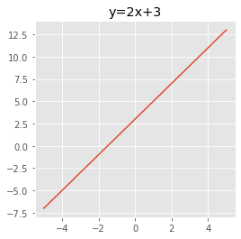
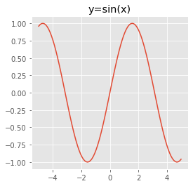

レポート_深層学習_前編

## day1 - 1. 入力層～中間層
### 要点
入力層からは、1つ以上の入力値 xi が、その入力値がどれくらい重要かを表す重み wi を掛け合わせたものに、バイアス b を加えた値が次の層に伝わっていく。

### 実装演習
[1-1.入力層～中間層.pdf](https://github.com/td035/rabbit-challenge/blob/master/stage3/pdf/1-1.入力層～中間層.pdf)

### 確認テスト
問：この図式に動物分類の実例を入れてみよう。  
  
解答：  
  


---

問：数式 u = Wx + b をPythonで書け  
  
解答： `u = np.dot(W, x) + b`
行列どうしの掛け算は、 `np.dot` 関数を使用する。

---

問：1-1のファイルから中間層の出力を定義しているソースを抜き出せ。  
  
解答：1_1_forward_propagation.ipynbより実装箇所を抜き出す。

```python
# 2層の総入力
u2 = np.dot(z1, W2) + b2

# 2層の総出力
z2 = functions.relu(u2)
```

`W2` が中間層の重みとなる。 `u2` が総入力値となり、活性化関数reluを通して、総出力 `z2` を計算している。

### 追加レポート
[追加レポート：1-1.入力層～中間層.pdf](https://github.com/td035/rabbit-challenge/blob/master/stage3/pdf/追加レポート：1-1.入力層～中間層.pdf)

## day1 - 2. 活性化関数
### 要点
活性化関数とは、次の層への出力の大きさを決める。これは、 **非線形の関数** である。入力の値(総入力)によって、次の層へ伝える信号のON/OFFや強弱を定める。

中間層で用いられる活性化関数
* ReLU
	* 現在、最も利用されている。
	* 勾配消失問題の回避や、スパース化に貢献している。
* シグモイド関数
	* ON/OFFだけでなく、信号の強弱を伝えられる。
	* 大きな値では、 **勾配消失問題** を引き起こすことがある。
* ステップ関数 (現在はあまり用いられない)

出力層で用いられる活性化関数
* ソフトマックス関数（多クラス分類）
* 恒等写像（回帰問題）
* シグモイド関数 (出力層にもシグモイド関数が用いられることがある)

### 実装演習
[1-2.活性化関数.pdf](https://github.com/td035/rabbit-challenge/blob/master/stage3/pdf/1-2.活性化関数.pdf)

### 確認テスト
問：線形と非線形の違いを図に描いて、簡易に説明せよ。  
  
解答：
線形な関数とは、以下の性質を満たす関数である。
* 加法性： f(x + y) = f(x) + f(y)
* 斉次性： f(kx) = k * f(x) (kはスカラー値) 
逆に、非線形は関数は上記の性質を満たさない。

線形な関数の例：  

  
非線形な関数の例：  


---

問：配布されたソースコードより該当する箇所( z = f(u) )を抜き出せ。  
  
解答：中間層から出力層に渡している活性化関数を探す。

```python
# 2層の総出力
z2 = functions.relu(u2)
```

「順伝播（3層・複数ユニット）」にて、中間層からReLU関数を利用し、出力層に出力値を渡している。

## day1 - 3. 出力層
### 要点
* 出力層では、最終的に入力データがどのラベルに分類されるかを決定する。この予測された出力と、実際のラベルを比較しどのくらい合っていたかを **誤差関数** で求めていく。
* 出力層と中間層の違いは、中間層は信号の強弱を調整していくが、出力層は信号の大きさ（比率）をそのままに変換する。例えば、分類問題なら出力層では各ラベルの分類を、 **総和が1** になるようにする。
* 出力層の種類
	* 恒等写像：入力値をそのまま通す。回帰問題で用いられる。
	* シグモイド関数：2値分類で用いられる。
	* ソフトマックス関数：多クラス分類で用いられる。

### 実装演習
[1-3.出力層.pdf](https://github.com/td035/rabbit-challenge/blob/master/stage3/pdf/1-3.出力層.pdf)

### 確認テスト
問：誤差を求める際、なぜ引き算でなく二乗するか述べよ。  
  
解答：引き算だと、負の値になってしまうことがある。正解ラベルと予測ラベルがどのくらいかけ離れているかを見たいので、二乗して符号を無関係にする必要がある。

問：下式の1/2はどういう意味を持つか述べよ。  
  
  
  
解答：後で誤差逆伝搬の計算で、誤差関数Eの微分を行うが、 `(y-d)^2` の微分で2が出現する。この2を消すために1/2しておいたほうが、微分した後の式を見やすくするため。
  
問：①～③の数式に該当するソースコードを示し、一行づつ処理の説明をせよ。  
数式に該当するコードは、ソフトマックス関数定義の以下の一行のみ。  
  
解答：  

```python
return np.exp(x) / np.sum(np.exp(x))
```

* ①は、②を③で割った値となる。コードでは、 `np.exp(x) / np.sum(np.exp(x))` となる。
* ②は、 `np.exp(x)` の部分。
* ③は、 `np.sum(np.exp(x))` の部分。

問：①～②の数式に該当するソースコードを示し、一行づつ処理の説明をせよ。  
  
解答：  

```python
return -np.sum(np.log(y[np.arange(batch_size), d] + 1e-7)) / batch_size
```

* ①は、returnで返却される計算結果。
* ②は、コードは一行で表現されているので関数の意味を分解して説明する。
	* `batch_size` は、ミニバッチの何番目かを表す。
	* `y[np.arange(batch_size), d]` で、予測値yと正解ラベルdを比較している。例えば、yが `[0.02, 0.06, 0.2, 0.72]` ならば `0.72` が返る。
	* `np.log` で対数をとる。対数はx=1のときlog(x)=0となるため、予測ラベルの確率が1に近いほど誤差が小さい、つまり良いモデルと言える。逆に、予測ラベルの確率が0に近いほどlog(x)は-∞に近づく。つまり、log(x)の値が小さい（絶対値が大きい）ほど、誤差が大きくなり悪いモデルと言える。ちなみに、数式でマイナスをかけているのは `-∞ < log(x) <= 0` のため符号を反転している。
	* `1e-7` を足しているのは、log(0)にならないように微小な値を足している。
	* 最後に、 `np.sum` ですべての誤差を合計している。

### 追加レポート
[追加レポート：1-3.出力層.pdf](https://github.com/td035/rabbit-challenge/blob/master/stage3/pdf/追加レポート：1-3.出力層.pdf)

## day1 - 4. 勾配降下法
### 要点
勾配降下法には、以下の３つがある。
* 勾配降下法
* 確率的勾配降下法
* ミニバッチ勾配降下法

深層学習の目的として、誤差E(w)を最小にするネットワークを作成することで、そのためにE(w)を最小にする重みパラメータwを見つけることである。その見つける方法が **勾配降下法** である。

**学習率** が大きすぎると、最小値にたどり着かず発散してしまう。逆に、学習率が小さすぎると最小値に収束するまで時間がかかりすぎてしまう。そのため、学習率は適切に設定する必要がある。学習率の決定や、収束性を向上するアルゴリズムは複数ある。（Momentum, AdaGrad, Adadelta, Adam等）

**確率的勾配降下法** は、ランダムに抽出したサンプルの誤差を求め、パラメータwを更新していく。メリットとして、計算コスト削減や、局所的最適解に収束してしまうリスクを軽減できる。また、オンライン学習ができるメリットもある。

**ミニバッチ勾配降下法** とは、メモリに保存できないような大量のデータを学習させたいとき、データを分割して学習させる手法。メリットとして、並列に同時学習できるためGPUで効率的な学習が行える。

### 実装演習
[1-4.勾配降下法.pdf](https://github.com/td035/rabbit-challenge/blob/master/stage3/pdf/1-4.勾配降下法.pdf)

### 確認テスト

問：以下の数式を実装しているソースコードを抜き出せ。  
  
  
解答：  
```python
network[key]  -= learning_rate * grad[key]
```

* `learning_rate` が学習率を表す。
* `grad[key]` が誤差の変化を表す。

問：オンライン学習とは何か？２行でまとめよ。  
  
解答：オンライン学習は、学習データの１つを取り出してパラメータの更新を行う。再度更新を行うときに、新たな学習データを取り出して更新処理を行っていく。そのため、最初はデータは十分ではないがリアルタイムに情報が集まってくるような場合に有効な学習法である。

問：この数式の意味を図に書いて説明せよ。  
  
  
  
解答：  


## day1 - 5. 誤差逆伝搬法
### 要点
誤差逆伝搬法とは、誤差Eを出力層側から逆に微分し、その値を前の層に伝え最終的に入力層まで微分していった値を伝えていく手法。数値微分よりも計算量が非常に少なく済む。

誤差逆伝搬法では、 **連鎖律** の考えを用いる。yがuの関数で、uがxの関数のとき、以下のようにyのxによる微分は以下のように表すことができる。  


誤差逆伝搬法によって、予測値yと正解dとの誤差から、重みWやバイアスbを更新して誤差を小さくしていくことができる。

### 実装演習
[1-5.誤差逆伝搬法.pdf](https://github.com/td035/rabbit-challenge/blob/master/stage3/pdf/1-5.誤差逆伝搬法.pdf)

### 確認テスト
問：誤差逆伝搬法では不要な再帰的処理を避けることができる。既に行った計算結果を保持しているソースコードを抽出せよ。  
  
解答：  
```python
delta2 = functions.d_mean_squared_error(d, y)
```
  
`d_mean_squared_error` 関数で、誤差関数Eをyで偏微分している。  
`delta2` に計算結果を保持し、後で入力層側の微分値を求める際に使用する。  
  
問：２つの空欄に該当するソースコードを探せ。  
  
  
解答：  
```python
delta2 = functions.d_mean_squared_error(d, y)
```
  
  

```python
grad['W2'] = np.dot(z1.T, delta2)
```

## day2 - 1. 勾配消失問題
### 要点
誤差逆伝搬法が下位層に進んでいくにつれ、勾配が緩やかになっていく。そのため、勾配降下法による更新では下位層のパラメータがほとんど変化しなくなり、最適解に収束しなくなる。これを勾配消失問題と呼ぶ。

勾配消失問題の解決法としては、以下が挙げられる。
* 活性化関数の選択
* 重みパラメータの初期値
* バッチ正規化

活性化関数にシグモイド関数を使った場合、微分した値は最大でも0.25になる。つまり、誤差逆伝搬で入力層へ伝わっていくたびに、パラメータがどんどん小さくなってしまう。  
そこで、ReLUを用いることで、勾配消失問題を防ぐことができる。ReLUは、微分値が1又は0になるため。1になるということは、そのパラメータは有用であり逆に0になるということは、そのパラメータは不要であると捉えることができる。

重みパラメータの初期値を設定する方法に、XavierとHeというのがある。以下のような方法をとることで、重みの初期値が偏った値とならず、ある程度ばらつきを保つことで、勾配消失を防止することができる。
* Xavier : 重みの要素を、前の層のノード数の平方根で割った値を初期値とする。
* He : 重みの要素を、前の層のノード数の平方根で割った値に、ルート2をかけた値を初期値とする。

バッチ正規化とは、ミニバッチ単位で、入力値のデータの偏りを抑制する方法。  
メリットは、中間層での学習が安定し、学習スピードが向上する。また、過学習を抑えることもできる。

### 実装演習
[2-1.勾配消失問題.pdf](https://github.com/td035/rabbit-challenge/blob/master/stage3/pdf/2-1.勾配消失問題.pdf)

### 確認テスト
問：シグモイド関数を微分した時、入力値が0のときに最大値をとる。その値として正しいものを選択肢から選べ。  
(1) 0.15  
(2) 0.25  
(3) 0.35  
(4) 0.45  
  
解答：(2)  
シグモイド関数は以下で表される。  
  
xで微分すると以下になる。  
  
x=0を代入する。  
  

問：重みの初期値に0を設定すると、どのような問題が発生するか。簡潔に説明せよ。  
  
解答：すべての重みの更新がすべて同じ値になってしまうため、多数の重みを持つ意味が無くなってしまう。結果として、学習が全くうまくいかない。

問：一般的に考えられるバッチ正規化の効果を2点挙げよ。  
  
解答：
* 学習を安定化できる。
* 過学習を抑制できる。

## day2 - 2. 学習率最適化手法
### 要点
**モメンタム**
誤差Eをパラメータで微分したもの∇Eと学習率εの積を減算した後、現在の重みに前回の重みV(t-1)を減算した値と慣性μの積μV(t-1)を加算することで、重みを更新w(t+1)する。移動平均の考え方に近い。  
前回の重みを利用するため、最初は学習の進みが遅いが、ある所から一気に学習が進み、最適解に収束していく。  
モメンタムのメリットは、局所的最適解にならず、大域的最適解となることと、谷間についてから最も低い位置（最適解）に行くまでの時間が早いことである。  

**AdaGrad**
これまでにどのような重み更新をしてきたかということを覚えながら、新たに重みを更新していく方法。  
メリットは、誤差関数が急でなく、勾配が緩やかな場合に最適解を見つけやすい特徴がある。デメリットとしては、学習率が小さくなっていくので、大域的最適解にたどり着きにくい（鞍点）問題があるということ。鞍点とは、どの方向に学習を進めていけばよいのか判断が難しい部分のこと。最適化手法があまり良くないものだと、鞍点から動かなくなってしまう。  

**RMSProp**
AdaGradを進化させたようなアルゴリズムとなっており、前回までの重み更新に関する情報を **どのくらい使うか** というのをパラメータαにより制御する。αが小さいと、これまでの更新情報をあまり利用しない。  
メリットは、大域的最適解になることと、ハイパーパラメータの調整をあまり行わなくてもよいということ。  

**Adam**
モメンタムとRMSPropの利点を兼ね備えたアルゴリズム。今の主流な最適化手法はこれである。

### 実装演習
[2-2.学習率最適化手法.pdf](https://github.com/td035/rabbit-challenge/blob/master/stage3/pdf/2-2.学習率最適化手法.pdf)

### 確認テスト
問：モメンタム・AdaGrad・RMSPropの特徴をそれぞれ簡潔に説明せよ。  
  
解答：モメンタムは勾配を移動平均で緩やかにしてから重み更新を行う。  
AdaGradは前回までの学習結果を利用しながら重み更新を行う。  
RMSPropはAdaGradの改良版で、前回までの学習結果をどのくらい利用するかを制御しながら重み更新を行う。

## day2 - 3. 過学習
### 要点
学習用データに対しての当てはまりは良いのだが、テストデータに対して当てはまりが悪くなってしまうことを過学習と呼ぶ。  
過学習の原因としては、パラメータ数が多すぎたり、パラメータの値が不適切だったりすることがある。ニューラルネットワークでは、ネットワークの自由度（層の数、ノード数、パラメータの値、等）がある。
  
過学習を抑制する方法として用いられるのが **正則化** であり、L1正則化、L2正則化、ドロップアウトがある。  
  
L1,L2正則化では、誤差関数に正則化項を設けることで、重みが大きくなりすぎないような制御をする。これにより、一部パラメータの値が大きすぎにならず、重みの重要さが全体的にばらけるようになる。  
  
L2正則化では、誤差関数にL2ノルムを与え、L1正則化ではL1ノルムを与える。L1正則化では、いくつかの重みパラメータが完全に0になる。L2正則化はかなり制約が強力なため、まずはL1正則化を試しそれでも過学習が解消されない場合にL1正則化を行うのがよい。  
  
ドロップアウトは、ノード数が多いことによる過学習を抑制する方法で、ある層のノード数をランダム数削除する。メリットは、データ数を変えずに異なるモデルを学習させていると結果的に解釈できること。  
一般的に、データにバリエーションが多くなると過学習が起きにくい。出力層に近づくにつれてより複雑なデータが伝わっていく。そういったデータの学習でドロップアウトをすることで出力層に近いデータにバリエーションが生まれ、過学習が起こりにくくなる。  

### 実装演習
[2-3.過学習.pdf](https://github.com/td035/rabbit-challenge/blob/master/stage3/pdf/2-3.過学習.pdf)

### 確認テスト
問：下図について、L1正則化を表しているグラフはどちらか答えよ。  
  
  
解答：右図  
誤差関数の等高線と正則化項の交点が、誤差関数に正則化項を加えたときの底になる。L1正則化では、交点を見ると横軸が0になっている。つまり、重みパラメータが0になる点を探してくれる。

## day2 - 4. 畳み込みニューラルネットワークの概念
### 要点
CNNは画像識別によく用いられるが、汎用的に扱うことができるため、画像に限らない。次元間でつながるデータならば、どれもCNNで扱える。  
CNNは畳み込み層とプーリング層の組み合わせからなる。  
  
**畳み込み層** では、入力画像をフィルターを使って特徴となる値を行列として出力する。その行列にバイアスを加え、活性化関数を通し最終的な行列を出力する。畳み込み層では、 **パディング** という処理で入力画像の周囲を0などの値で画像サイズを拡張したり、 **ストライド** という処理でフィルターを動かす距離を決めていく。  
  
**プーリング層** では、入力画像のある領域について、その領域のMAX値や平均値を求め、すべての領域について同じ処理を施し行列を出力する。  

### 実装演習
[2-4.畳み込みニューラルネットワークの概念.pdf](https://github.com/td035/rabbit-challenge/blob/master/stage3/pdf/2-4.畳み込みニューラルネットワークの概念.pdf)

### 確認テスト
問：サイズ6x6の入力画像を、サイズ2x2のフィルタで畳み込んだ時の出力画像のサイズを答えよ。なおストライドとパディングは1とする。  
  
解答：  


## day2 - 5. 最新のCNN
### 要点
**AlexNet**
モデルの構造：5層の畳み込み層およびプーリング層など、それに続く3層の全結合層から構成される。  
入力画像は224x224で、11x11のフィルタで畳み込みを行う。その際に、チャネルを96に増やす。フィルタが大きいので、出力はかなり圧縮され、チャネル数は96になる。これをMaxPoolingで更に圧縮し、チャネル数は256になる。これを更にMaxPoolingで圧縮し、チャネル数は384になる。  
最終的に13x13x256になり、これを全結合層で平滑化を行い、4096の入力値になり、あとは通常のニューラルネットワークと同じ処理を行っていく。

### 実装演習
[2-5.最新のCNN.pdf](https://github.com/td035/rabbit-challenge/blob/master/stage3/pdf/2-5.最新のCNN.pdf)

PyTorchでAlexNetを実装した例を見つけたので、これを実装し動作確認を行う。  
※ 学習データはCIFAR-10を使用している。  
http://cedro3.com/ai/pytorch-alexnet/

### 確認テスト

確認テストが存在しないため、考察結果として「AlexNetがILSVRCにおいて、どんなことが革新的であったか」について記載する。  
  
2012年までは、画像から特徴量を抽出する際に、人の手によって物体の色・輝度・形などの特徴量を設計していた。これが、AlexNetでは特徴量の設計を行わずとも、十分なデータがあればネットワーク自身で特徴量を見つけ出すことができるようになった。  
  
今の画像分類ネットワークは、AlexNetを元にしたアルゴリズムとなっている。例えば、今は当たり前に行われている活性化関数にReLUを採用したことや、画像データの水増し、ドロップアウトといった概念もAlexNetで採用された技術である。  
  
参考サイト  
https://axa.biopapyrus.jp/deep-learning/cnn/image-classification/alexnet.html

### 追加レポート

以下のリンクを参考に、ILSVRCについてまとめる。  
* https://anieca.work/archives/83
* https://anieca.work/archives/115
* https://anieca.work/archives/147

#### ILSVRCについて
ILSVRC (ImageNet Large Scale Visual Recognition Challenge) は、ImageNetと呼ぶ画像データセットに対し、分類精度を競うコンペで2010年から2017年まで毎年開催されていた。  
  
2012年に、AlexNetが登場し2位以下に大差をつけて優勝した。これによりDeep Learningが注目されるようになった。  
  
2013年に、 **ZFNet** が優勝した。AlexNetとの違いとして以下がある。  
* 第1層のkernel sizeを11から7にし、strideを4から2にした。
* 3,4,5層を単一GPU処理に変更した。
  
AlexNetではkernel sizeが大きすぎるため、特徴マップがうまく抽出できなかった。ZFNetでは、小さくすることでこの問題を解決した。  
また、AlexNetでは第2層の特徴マップがエイリアシング（雑音）が多いためうまく特徴量を伝えることが出来ていなかった。ZFNetではstrideの量を減らすことで特徴を伝えることができるようになった。  
  
2014年に、 **GoogLeNet** が優勝し、またこの年は2位の **VGGNet** も注目された。  
  
**GoogLeNet** は21層のCNNで、Inceptionモジュールを繋ぐことで大きなネットワークを形成した。Inceptionモジュールとは、ネットワークを分岐させサイズの異なる畳み込みを行った後に出力を結合する。分岐することで、畳み込み層1つあたりのパラメータ数を削減できるようになった。また、Global Average Pooling層を最後の畳み込みで利用することで、全結合層によるパラメータ数の増加を防ぎ、過学習を抑制することに成功した。  
  
**VGG** (VERY DEEP CONVOLUTIONAL NETWORKS FOR LARGE-SCALE IMAGE RECOGNITION)は、GoogLeNetほどではないが深い層で構成される。例えば、3x3の畳み込み層を2回通すのと5x5の畳み込み層を1回通すのは実質的に同じ効果ながら、計算コストは3x3を2回通すほうが小さくなる。  
  
2015年に **ResNet** が優勝し、これは34層のCNNからなる。ResNetの特徴としては、 **Residual Module** と **Batch Normalization** がある。  
  
Residual Moduleは、2～3畳み込みをした後、畳み込み前の特徴を足すことで、層を増やしすぎることによる勾配消失問題を解消している。  
Batch Normalizationは、ある層のパラメータ更新が次の層への入力分布がバッチ毎に大きく変化する問題 (**内部共変量シフト**) を改善する。  内部共変量シフトを正規化し、バッチ毎に入力分布が大きく変動しない状況で学習が行えるようにした。
