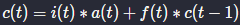
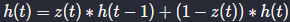
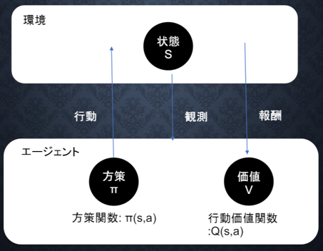

レポート_深層学習_後編

# 深層学習 day3
## Section1: 再帰型ニューラルネットワークの概念
### 要点
* RNNとは時系列データに対応ができるニューラルネットワークで、時系列データとは時間的に繋がりのあるデータで、音声やテキストデータ等がある。
* RNNでは、中間層の出力を繰り返し中間層に入力し、最終的に出力層に渡す。
* RNNの特徴は、初期の状態と過去の時間t-1までの状態を保持しながら、次の時間tを再帰的に求めていく。
* BPTTとは、RNNにおいての誤差逆伝搬を指す。

BPTTの数式とコード


```python
np.dot(X.T, delta[:, t].reshape(1, -1))
```


```python
np.dot(z[:, t+1].reshape(-1, 1), delta_out[:, t].reshape(-1, 1))
```


```python
np.dot(z[:, t].reshape(-1, 1), delta[:, t].reshape(1, -1))
```

### 実装演習

https://github.com/td035/rabbit-challenge/blob/master/stage4/jupyter_notebook/4-1_RNN.ipynb


### 確認テスト

問：
* RNNのネットワークには大きく分けて3つの重みがある。1つは入力から現在の中間層を定義する際にかけられる重み、1つは中間層から出力を定義する際にかけられる重みである。残り1つの重みについて説明せよ。

解答：
* 中間層から、繰り返し中間層へ入力として値を渡すときに、その入力にかけられる重み。

---

問：
* 以下は再帰型ニューラルネットワークにおいて構文木を入力として再帰的に文全体の表現ベクトルを得るプログラムである。ただし、ニューラルネットワークの重みパラメータはグローバル変数として定義してあるものとし、 `_activation` 関数は何らかの活性化関数であるとする。木構造は再帰的な辞書で定義してあり、 `root` が最も外側の辞書であると仮定する。(く)にあてはまるのはどれか？

```python
def traverser(node):
	if not isinstance(node, dict):
		v = node
	else:
		left = traverse(node['left'])
		right = traverse(node['right'])
		v = _activation(く)
	return v
```

- (1) W.dot(left + right)
- (2) W.dot(np.concatenate([left, right]))
- (3) W.dot(left * right)
- (4) W.dot(np.maximum(left, right))

解答：(2)
* left, rightはそれぞれ何らかの数値の配列になっている。これらの数値は足したり掛け合わせると情報の意味が変わってしまう。leftとrightを組み合わせるのが正しいので、(2)が正解。

---

問：
* 連鎖律の原理を使い、dz/dxを求めよ。
	* z = t^2
	* t = x + y

解答：
* 

---

問：
* 下図のy1をx・s0・s1・w_in・w・w_outを用いて数式で表せ。
	* ※バイアスは任意の文字で定義せよ。
	* ※また中間層の出力にシグモイド関数g(x)を作用させよ。

解答：
* a

## Section2: LSTM
### 要点
LSTMはRNNの一種。

RNNの問題点として、中間層では活性化関数を通すため、勾配消失問題が発生していた。そのため、LSTMではCECという部品にこれまでの入力値や出力値の状態を記憶させている。具体的には、勾配が1であれば解決できる。勾配が1より大きいと、勾配爆発が発生し、1より小さいと勾配消失が発生する。

CECには学習機能が無いため、CECの周りに学習機能を配置する。これが入力ゲートと出力ゲートである。 **入力ゲート** からCECに覚えてほしい情報を与える。その際、入力ゲートで学習を行う。 **出力ゲート** は、CECからの情報をどのように利用するかを決め、どのようにCECからの情報を利用すればよいかということを学習する。

 LSTMブロックの課題として、CECは過去の情報がすべて保管されているため、過去の情報が不要になった場合、削除できず保管され続ける。そのため、過去の情報が不要になった時点で情報を忘却する機能として、 **忘却ゲート** がある。

忘却ゲートは、今回の入力と前回の出力で忘却するかを判断する。

### 確認テスト
問：
* 以下の文章をLSTMに入力し空欄に当てはまる単語を予測したいとする。文中の「とても」という言葉は空欄の予測においてなくなっても影響を及ぼさないと考えられる。このような場合、どのゲートが作用すると考えられるか？
	* 「映画おもしろかったね。ところで、とてもお腹が空いたから何か___。」

回答：
* 問にもあるように、空欄の予測に不要な情報のため、忘却ゲートで忘れてしまってもよい。よって、答えは「忘却ゲート」。

---

演習チャレンジ
* 以下のプログラムはLSTMの順伝搬を行うプログラムである。ただし `_sigmoid` 関数は要素ごとにシグモイド関数を作用させる関数である。（け）に当てはまるのはどれか？

```python
def lstm(x, prev_h, prev_c, W, U, b):
    lstm_in = _activation(x.dot(W.T) + prev_h.dot(U.T) + b)
		a, i, f, o = np.shplit(lstm_in, 4)
		
		a = np.tanh(a)
		input_gate = _sigmoid(i)
		forget_gate = _sigmoid(f)
		output_gate = _sigmoid(o)
		
		c = （け）
		h = output_gate * np.tanh(c)
		
		return c, h
```

* (1) output_gate * a + forget_gate * c
* (2) forget_gate * a + output_gate * c
* (3) input_gate * a + forget_gate * c
* (4) forget_gate * a + input_gate * c

解答：3

- 以下の数式をコードに当てはめる。
    - 

## Section3: GRU
### 要点
* LSTMは、パラメータ数が多く、計算負荷が高くなるという課題があった。
* GRUでは、そのパラメータを大幅に削減し計算負荷を軽減させつつも、精度は同等またはそれ以上が望めるようになった。
* LSTMとの違い：CECがなくなった。入力ゲートと出力ゲートが無くなり、代わりにリセットゲートと更新ゲートが登場した。

### 確認テスト
問：
* LSTMとCECが抱える課題について、それぞれ簡潔に述べよ。

解答：
* LSTMは全体的に計算負荷が高いこと、CECに学習能力が無いため、入力ゲートや出力ゲート等で構成する必要があるため、構造が複雑であること。

---

演習チャレンジ：
以下のプログラムはGRUの順伝搬を行う。ただし、 `_sigmoid`  は要素ごとにシグモイド関数を作用させる。（こ）に当てはまるのはどれか？

```python
def gru(x, h, W_r, U_r, W_z, U_z, W, U):
		# ゲートを計算
		r = _sigmoid(x.dot(W_r.T) + h.dot(U_r.T))
		z = _sigmoid(x.dot(W_z.T) + h.dot(U_z.T))
		
		# 次状態を計算
		h_bar = np.tanh(x.dot(W.T) + (r * h).dot(U.T))
		h_new = （こ）
		
		return h_new
```

* (1) z * h_bar
* (2) (1 - z) * h_bar
* (3) z * h * h_bar
* (4) (1 - z) * h + z * h_bar

解答：4
以下の数式をコードに当てはめる。


---

問：
* LSTMとGRUの違いを簡潔に述べよ。

解答：
* LSTMは、CECと入力ゲート、出力ゲート、忘却ゲートがある。GRUはリセットゲートと更新ゲートがあり、CECのような記憶するだけの部品は存在しない。LSTMはGRUより構造が複雑で、GRUのほうが計算量が少なく済む。

## Section4: 双方向RNN
### 要点
* 双方向RNNとは、過去の情報だけでなく未来の情報を加味することで精度を向上させるためのモデル。
* 実用例として、文章推敲（誤字・脱字等の検出）や機械翻訳等が挙げられる。
* 未来の情報が必要であることから、双方向RNNの応用範囲は限定される。

### 確認テスト
演習チャレンジ：
以下は双方向RNNの順伝搬を行うプログラムである。順方向については、入力から中間層への重みW_f, 1ステップ前の中間層出力から中間層への重みをU_f, 逆方向に関してはパラメータW_b, U_bを持ち、両者の中間層表現を合わせた特徴から出力層への重みはVである。 `_rnn` 関数はRNNの順伝搬を表し中間層の系列を返す関数であるとする。（か）に当てはまるのはどれか。

```python
def bidirectional_rnn_net(xs, W_f, U_f, W_b, U_b, V):
		"""
		W_f, U_f: forward rnn weights, (hidden_size, input_size)
		W_b, U_b: backward rnn weights, (hidden_size, input_size)
		V: output weights, (output_size, 2*hidden_size)
		"""
		xs_f = np.zeros_like(xs)
		xs_b = np.zeros_like(xs)
		for i, x in enumerate(xs):
				xs_f[i] = x
				xs_b[i] = x[::-1]
				
		hs_f = _rnn(xs_f, W_f, U_f)
		hs_b = _rnn(xs_b, W_b, U_b)
		hs = [（か） for h_f, h_b in zip(hs_f, hs_b)]
		ys = hs.dot(V.T)
		
		return ys
```

* (1) h_f + h_b[::-1]
* (2) h_f * h_b[::-1]
* (3) np.concatenate([h_f, h_b[::-1]], axis=0)
* (4) np.concatenate([h_f, h_b[::-1]], axis=1)

解答：(4)
* 双方向RNNでは、順伝搬と逆伝搬それぞれの中間層表現を合わせたものが特徴量となるので、NumPyの結合する関数である `concatenate` を使用したのが正解である。また、列方向の結合なので `axis=1` となる。

## Section5: Seq2Seq
### 要点
Seq2Seqとは、系列(Sequence)を入力として、系列を出力するものをいう。Encoder-Decoderモデルとも呼ばれる。

実用上では、「入力→出力」と系列情報を変換していくものが多い。
例：
- 翻訳（英語→日本語）
- 音声認識（波形→テキスト）
- チャットボット（テキスト→テキスト）

Seq2Seq2を理解するには、RNNの理解と言語モデルの理解が必要。
言語モデルとは、単語の並びに確率を与える。これは、単語の並びに対し文章として自然かを確率で評価する。時刻t-1までの情報で、時刻tの事後確率を求めることが目標で、ここから同時確率が計算できる。

RNN x 言語モデル
- RNNは系列情報を内部状態に変換できる。
- 文章の各単語が現れる際の同時確率は、事後確率で分解できる。
- 言語モデルを再現できるようRNNの重みが学習されていれば、ある時点の次の単語を予測できる。
	- つまり、先頭の単語を与えれば文章を生成することも可能。

### 確認テスト

問：下記の選択肢から、seq2seqについて説明しているものを選べ。
* (1) 時刻に関して順方向と逆方向のRNNを構成し、それら2つの中間層表現を特徴量として利用するものである。
* (2) RNNを用いたEncoder-Decoderモデルの一種であり、機械翻訳などのモデルに使われる。
* (3) 構文木などの木構造に対して、隣接単語から表現ベクトル（フレーズ）を作るという演算を再帰的に行い（重みは共通）、文全体の表現ベクトルを得るニューラルネットワークである。
* (4) RNNの一種であり、単純なRNNにおいて問題となる勾配消失問題をCECゲートの概念を導入することで解決したものである。

解答：(2)

- (1)は双方向RNNの説明、(3)は構文木の説明、(4)はLSTMの説明。

---

演習チャレンジ：機械翻訳タスクにおいて、入力は複数の単語からなる文（文章）であり、それぞれの単語はone-hotベクトルで表現されている。Encoderにおいて、それらの単語は単語埋め込みにより特徴量に変換され、そこからRNNによって（一般にはLSTMを使うことが多い）時系列の情報をもつ特徴へとエンコードされる。以下は、入力である文（文書）を時系列の情報をもつ特徴量へとエンコードする関数である。ただし、 `_activation` 関数はなんらかの活性化関数を表すとする。（き）に当てはまるのはどれか。

```python
def encode(words, R, W, U, b):
		"""
		words: sequence words (sentence), one-hot vector, (n_words, vocab_size)
		E: word, embedding matrix, (embed_size, vocab_size)
		W: upward weights, (hidden_size, hidden_size)
		U: lateral weights, (hidden_size, embed_size)
		b: bias, (hidden_size,)
		"""
		hidden_size = W.size[0]
		h = np.zeros(hidden_size)
		for w in words:
				e = （き）
				h = _activation(W.dot(e) + U.dot(h) + b)
				
		return h
```

* (1) E.dot(w)
* (2) E.T.dot(w)
* (3) w.dot(E.T)
* (4) E * w

解答：(1)

---

問：VAEに関する下記の説明文中の空欄に当てはまる言葉を答えよ。

- 「自己符号化器の潜在変数に＿＿を導入したもの。」

解答：確率分布

---

問：seq2seqとHRED、HREDとVHREDの違いを簡潔に述べよ。
解答：seq2seqは、ある時系列データから別の時系列データを得るための手法。HREDは、それまでの文脈の意味ベクトルを解釈に含めることで、文脈を含めたエンコードとデコードをできるようにしたもの。VHREDは、VAEの考えを取り入れて、HREDでは当たり障りのない単語以上の出力が出来るように改良を施したもの。

## Section6: Word2vec
### 要点
RNNでは、単語のような可変長の文字列をニューラルネットワークに与えることはできないという課題があった。固定長形式で単語を表す必要がある。

word2vecは、学習データからボキャブラリを作成し、一つ一つの単語で意味どうしが近くなるベクトルを見つける。
例）学習データ：「I want to eat apples. I like apples.」
→ {apples, eat, I, like, to, want} (これはone-hotベクトルで表現する)

one-hotベクトルをそのまま使うと、単語数が多いとone-hotベクトルは非常に大きくなってしまう。そこで、embedding表現という数値ベクトルに変換する。ここまでの処理をword2vecという。

word2vecによって、大規模データの分散表現の学習が現実的な計算速度とメモリ量で実現可能になった。ボキャブラリxボキャブラリの重み行列でなく、 **ボキャブラリx任意の単語ベクトル次元** が作成される。

### 確認テスト

問：
- RNNとword2vecの違いを簡潔に述べよ。

解答：
- RNNは時系列データを扱うのに適したニューラルネットワークで、単語の分散表現ベクトルを得るための手法。

## Section7: Attention Mechanism
### 要点
seq2seqは、長い文章への対応が難しいという問題がある。これは、単語数に関わらず **固定次元ベクトル** に入力する必要があるため。この問題への解決策として、文章が長くなるほどそのシーケンスの内部表現の次元も大きくしていくという仕組みが Attention Mechanism と呼ぶ。これは、「入力と出力のどの単語が関連しているか？」という関連度を学習する仕組みである。近年、精度の高い言語処理モデルはすべてAttention Mechanismである。

### 確認テスト

問：
- seq2seqとAttentionの違いを簡潔に述べよ。

解答：
- seq2seqは、1つの時系列データから別の時系列データを得るための手法。Attension Mechanismは、時系列データの中身に対して関連性に重みをつける手法。

# 深層学習day4

## Section1: 強化学習
### 要点
エージェントに行動をさせ、行動の結果による報酬を与え、報酬を最大化させるような行動を決定していく学習を、強化学習と呼ぶ。

環境について事前に完璧な知識があれば、最適な行動を決定することは可能だが、強化学習ではそのような仮定は成り立たないものとする。不完全な知識を元に行動しながらデータを収集していき、最適な行動を見つけていく。

過去のデータから最良とされる行動ばかり取り続けると、更に良い行動があるかもしれないのに、それを見つけることができない。これを「探索が足りない状態」と呼ぶ。また、過去のデータを気にせず未知の行動ばかり取り続けることを「利用が足りない状態」と呼ぶ。そして、両者はトレードオフの関係性がある。

#### 強化学習イメージ図



* エージェントは、方策に基づいて行動する。
* 方策関数πとは、ある状態Sでどのような行動をとるのかという確率を与えるもの。
* 行動価値関数Qとは、状態Sと価値Vを組み合わせた価値に注目した関数のこと。

### 実装演習
以下リンクを参考に実装を行う。
- https://pytorch.org/tutorials/intermediate/reinforcement_q_learning.html

## Section2: AlphaGo
### 要点
AlphaGoには、AlphaGo LeeとAlphaGo Zeroがある。AlphaGo Leeは2つのニューラルネットワークを使用し、PolicyNetは方策関数でValueNetは価値関数。どちらも畳み込みニューラルネットワークである。

#### Alpha Go の PolicyNet
入力：19x19の二次元データ, 48チャンネル（碁に関する特徴）
→ 畳み込み層（Filters: 192, Kernel Size: 5x5, Strides: 1, Zero Padding: 2）
→ ReLU関数
→ 以下を11回繰り返し
　→ 畳み込み層（Filters: 192, Kernel Size: 3x3, Strides: 1, Zero Padding: 1）
　→ ReLU関数
 → 畳み込み層 (Filters: 1, Kernel Size: 1x1, Strides: 1)
 → Softmax関数
 → 出力

#### Alpha Go の ValueNet
入力：19x19の二次元データ, 49チャンネル（碁に関する特徴）
→ 畳み込み層（Filters: 192, Kernel Size: 5x5, Strides: 1, Zero Padding: 2）
→ ReLU関数
→ 以下を11回繰り返し
　→ 畳み込み層（Filters: 192, Kernel Size: 3x3, Strides: 1, Zero Padding: 1）
　→ ReLU関数
 → 畳み込み層 (Filters: 1, Kernel Size: 1x1, Strides: 1)
 → 全結合層: 256 Units
 → 全結合層: 1 Unit
 → tanh関数
 → 出力

ValueNetでは、入力チャンネルに「手番」が追加されている。

#### Alpha Goの学習

1. 教師あり学習によるRollOutPolicyとPolicyNetの学習
    * KGS Go Server (ネット囲碁対局サイト) の棋譜データから3000万局面分の学習データを用意した。
2. 強化学習によるPolicyNetの学習
	* PolicyPoolという、PolicyNetの強化学習過程を500イテレーション毎に保存したデータと、現状のPolicyNetを対戦させ、方策勾配法で学習させる。
	* 現状のPolicyNet同士の対戦をさせなかった理由は、過学習ほ防ぐため。
	* この学習をバッチサイズ128で1万回行った。
3. 強化学習によるValueNetの学習
	* 以下の手順で教師データを作成した。
		1. SL PolicyNet (教師あり学習で作成したPolicyNet) でN手まで打つ。
		2. N+1手目をランダムに選択し、その手で進めた局面をS (N+1) とする。
		3. S (N+1) から RL PolicyNet (強化学習で作成したPolicyNet) で終局まで打ち、その勝敗報酬をRとする。 

S (N+1) とRを教師データとし、損失関数を平均二乗誤差とした回帰問題で、バッチサイズ32で5000万回学習させた。
N手までとN+1手からのPolicyNetを別々にした理由は、過学習を防止するため。

####  AlphaGo Zero の AlphaGo (Lee) との違い

* 教師あり学習を行わず、強化学習のみを行った。
* 特徴入力からヒューリスティックな要素を排除し、石の配置のみとした。
* PolicyNet と ValueNet を1つのネットワークにした。
* Residual Net を導入した。これは、ショートカットを追加して勾配爆発・消失を抑えるもの。
* モンテカルロ木探索から RollOutシミュレーションを無くした。

## Section3：軽量化・高速化技術
### 要点

#### GPUによる高速化

* GPGPU (General-purpose on GPU)
	* 元々の使用目的であるグラフィック以外の用途で使用されるGPUの総称
	* CUDA: NVIDIA社が開発。Deep Learning用のため、使いやすい。
	* OpenCL: NVIDIA以外のGPUでも使用可能だが、Deep Learning用ではない。
* GPU
	* 比較的低性能なコアが多数
	* 簡単な並列処理が得意
	* ニューラルネットワークの学習は単純な行列計算が多いため、高速化可能

#### モデル軽量化
モデルの精度を保ちつつパラメータや演算回数を低減する手法。モバイルやIoT機器に有用。

* 量子化
	* 64bit浮動小数点を32bitなど下位の精度に落とす。
	* 実際は、倍精度を単精度にしてもほぼ精度は変わらない。ただ、極端に落とさないこと。
* 蒸留
	* 規模の大きなモデルをそのまま使うのでなく、その知識を軽量なモデルに継承させて使用する。
	* 蒸留は、教師モデルと生徒モデルで構成される。教師モデルは精度の高い複雑なモデルで、生徒モデルは教師モデルを元に作られるモデル。
	* 教師モデルの重みを固定し生徒モデルの重みを更新していく。教師モデルと生徒モデルそれぞれの誤差を使い、重みを更新する。
* プルーニング
	* モデルの精度に寄与が少ないニューロンを削減することでモデルの軽量化・高速化を行う。

## Section4: 応用モデル
### 要点
#### MobileNet

- MoblieNetは、デプスワイズ畳み込みとポイントワイズ畳み込みの組み合わせにて、通常の畳み込みに比べ計算量の削減を実現した。
- デプスワイズ畳み込みは、入力マップのチャネルごとに畳み込みを行い、出力マップをそれらと結合する。この畳み込みでは、層間の畳み込みは考慮されていない。
- ポイントワイズ畳み込みでは、入力マップのポイントごとに畳み込みを行い、出力マップはフィルタ数分だけ作成可能。

#### DenseNet

- DenseNetでは、出力層に前の層の入力を足し合わせる。
- 特徴マップの入力に対し、下記の手順で出力を計算する。
	1. バッチ正規化
	2. RuLUによる変換
	3. 3x3畳み込み 
- 計算した出力に入力特徴マップを足し合わせる。
	- 入力特徴マップのチャンネル数が l * k の場合、出力は (l+1) * k となる。
	- k をネットワークの成長率(growth rate)と呼ぶ。kが大きいほどネットワークが大きくなるため、小さい値に設定するのが良い。
	- 特徴マップのサイズを変更し、ダウンサンプリングを行うため、 Transition Layerという層でDense Blockを繋ぐ。

#### 正規化レイヤ

- Batch Norm: ミニバッチに含まれるsampleの同一チャネルが同一分布に従うよう正規化
- Layer Norm: それぞれのsampleの全てのピクセルが同一分布に従うよう正規化
- Instance Norm: 更にチャンネルも同一分布に従うよう正規化

### 確認テスト

問1. （あ）に当てはまる言葉を選択肢から選べ。

深層学習を用いて結合確率を学習する際に、効率的に学習が行えるアーキテクチャを提案したことがWaveNetの大きな貢献の１つである。提案された新しいConvolution型アーキテクチャは（あ）と呼ばれ、結合確率を効率的に学習できるようになっている。

1. Dilated casual convolution
2. Depthwise separable convolution
3. Pointwise convolution
4. Deconvolution

解答：1

---

問2. （い）に当てはまる言葉を選択肢から選べ。
（あ）を用いた際の大きな利点は、単純なConvolution layerと比べて（い）ことである。

1. パラメータ数に対する受容野が広い
2. 受容野あたりのパラメータ数が多い
3. 学習時に並列計算が行える
4. 推論時に並列計算が行える

解答：1

## Section5: Transformer
### 要点
例：ニューラル機械翻訳では、Encoder-Decoderモデルを用いた。
Encoder RNNで、 **翻訳元** の文を読み込み実数値ベクトルに変換する。
Decoder RNNで、先ほどの実数値ベクトルから **翻訳先言語** の文を生成する。

問題点は、長い文章になるほどBLEUスコアが大きく下がる。これは、一つのベクトルで表現しているため、文章が長くなると表現力が足りなくなるため。
これを解決するため、Attensionの機構ができた。これは、情報量が多くなってきた際に何に注意を払い、何に注意を払わないべきかということを学習的に決定していくもの。Attentionは query, key, value の3要素に分けられる。query(検索クエリ)に一致するkeyを索引し、対応するvalueを取り出す。

Transformerは2017年6月に登場した。RNNを使用せず、Attentionのみを使用する。当時のSOTAをはるかに少ない計算量で実現した。

- Encoder
	1. 単語ベクトルに単語の位置情報を追加する。RNNを使用しないため、位置情報が無いため。
	2. 複数のヘッドで行う Dot Product Attention 機構
	3. 単語の位置ごとに独立処理する全結合
- Decoder
	1. 未来の単語を見ないようマスクする。
	

注意機構には、 Source Target Attention (ソース・ターゲット注意機構) と Self-Attention (自己注意機構) がある。Source Target AttentionはQueryをTarget、KeyとValueをSourceに分けて、Sourceに近いTargetのみを注目する。Self-AttentionはQuery、Key、ValueすべてがSourceとなる。つまり、自分の入力だけで学習的に注意箇所を決めていく。

Scaled Dot-Product Attentionという機構は、全単語に関するAttentionをまとめて計算する。8個のScaled Dot-Product Attentionの出力を結合し、それぞれのヘッドが異なる種類の出力情報を収集したものをMulti-Head Attentionと呼ぶ。

## Section6: 物体検知・セグメンテーション
### 要点

物体検出では、クラスに分類するだけでなくどの位置にあるかを検知する。この位置をバウンディングボックスと呼ぶ。閾値変化による振る舞いでは、設定された閾値以上の確信度だと、そのときのバウンディングボックスと予測クラスが与えられる。

代表的データセットには、VOC12、ILSVRC17、MS COCO18、OICOD18がある。各データセットはクラス数が異なるが、必ずしもクラス数が多いものを使用せず、目的に応じたデータセットを使用する。

**IoU (Intersection over Union)**
物体検出においてクラスラベルだけでなく、物体位置の予測精度も評価したいとき、この指標を用いる。IoUは、分母に「正解の物体位置 又は 予測の物体位置」、分子に「正解の物体位置 かつ 予測の物体位置」とし、これを求めた値となる。正解の物体位置は Ground-Truth BB、予測の物体位置は Predicted BB と呼ばれる。

物体検知では、検出精度に加え検出速度（FPS: Flames per Second）も問題となる。

物体検知のフレームワークでは2段階検出器と1段階検出器がある。
- 2段階検出器（Two-stage detector）
	- 候補領域の検出とクラス推定を別々に行う。
	- 相対的に精度が高いが計算量が大きく推論も遅い傾向がある。
- 1段階検出器（One-stage detector）
	- 候補領域の検出とクラス推定を同時に行う。
	- 相対的に精度が低いが計算量が小さく推論も早い傾向がある。

#### SSD

- SSDでは、Default Boxを用意し、検出したい物体に当てはめる。ここから、学習によってDefault Boxを検出したい物体に近づけるよう変形していき、確信度を出力する。
- SSDの構造は、基本はVGG16だが、以下の部分が異なる。
	- 入力サイズに応じてSSD300（300px × 300px）や SSD512（512px × 512px）等が入力データとなる。
	- VGG16の全結合層層2層を畳み込み層に変更する。（最後の全結合層は削除）

#### セマンティックセグメンテーション
セマンティックセグメンテーションとは、画像の全ての要素にカテゴリを関連づける手法。物体検出との違いは、物体検出はバウンディングボックスで対象物を囲むのに対し、セマンティックセグメンテーションでは対象物を画素レベルで領域を分ける。

### 実装演習

https://github.com/td035/rabbit-challenge/blob/master/stage4/jupyter_notebook/SSD_PyTorch.ipynb


### 確認テスト

問. 車、人、犬の物体検出を行い、以下の表のような結果が与えられた。確信度の閾値を0.5、IoUの閾値を0.5としたとき、PrecisionとRecallを求めよ。

| * | 確信度 | 予測クラス | IoU |
| ---- | ---- | ---- | ---- |
| P1 | 0.92 | 人 | 0.88 |
| P2 | 0.85 | 車 | 0.46 |
| P3 | 0.81 | 車 | 0.92 |
| P4 | 0.70 | 犬 | 0.83 |
| P5 | 0.69 | 人 | 0.76 |
| P6 | 0.54 | 車 | 0.20 |

解答
- P1は、IoU > 0.5 よりTP (人が検出された)
- P2は、IoU < 0.5 よりFP
- P3は、IoU > 0.5 よりTP (車が検出された)
- P4は、IoU > 0.5 よりTP (犬が検出された)
- P5は、IoU > 0.5 だが、既に人は検出されている。確信度の高い検出が優先されるためFP扱いとなる。
- P6は、IoU < 0.5 よりFP

Precisionは TP / (TP + FP) = 3 / (3 + 3) = 0.5
Recallは TP / (TP + FN) = 3 / (3 + 0) = 1.0

